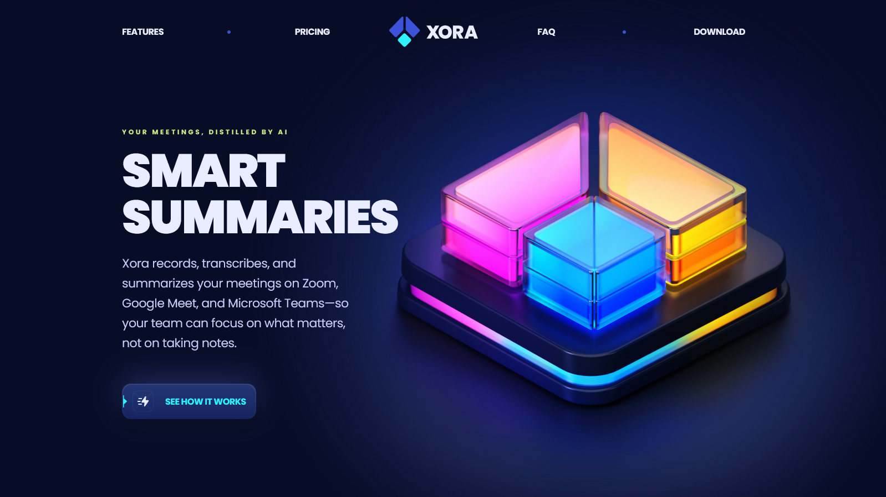

# Xora - SaaS Landing Page

Xora is a Modern UI/UX SaaS website developed using React.js and Tailwind CSS that exemplifies modern UI/UX principles. Its sleek design, seamless animations, and overall user experience set a high standard, serving as a reference or inspiration for future modern applications or websites in general.

### Key Features

- **Stunning Sections**: Includes hero, features, pricing (monthly/yearly), FAQ, testimonials, and download software sections.
- **Smooth Animations**: Complex CSS for fluid animations and eye-catching effects.
- **Cool CSS Gradients**: Beautiful gradient effects using CSS `before` and `after` pseudo-elements.
- **Optimized Performance**: Built for fast loading and an optimized experience.
- **Pixel Perfect Design**: Ensures flawless responsiveness across all devices and screen sizes.

### Tech Stack

This project is built using the following technologies:

- [Vite](https://vitejs.dev/) - A fast build tool and development server.
- [React](https://reactjs.org/) - A JavaScript library for building user interfaces.
- [Tailwind CSS](https://tailwindcss.com/) - A utility-first CSS framework for rapid UI development.
- [Typescript](https://www.typescriptlang.org/) - A strongly typed programming language for scalable and maintainable code.

### Landing Page Preview

[View Full Preview](https://gumarques.github.io/saas_landing_page/)
